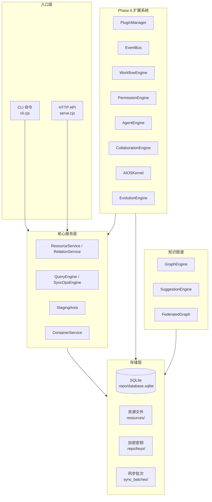
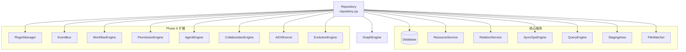

## 架构分析

### 一、架构全景

lo 是一个本地优先、端到端加密的资源管理工具。所有逻辑在客户端，远程只是一个通过 SSH 访问的裸目录。



核心设计原则：
- **本地优先**：所有数据以明文存储在本机，离线完全可用
- **端到端加密**：中继服务器只能看到密文，无法解密内容
- **操作日志复制**：同步的不是数据库文件，而是可重放的操作日志
- **不可变 RID**：资源 ID 基于创建时间和随机数，永不改变
- **资源平等**：所有文件都是资源，类型只是属性之一

### 二、数据存储层（三层 + 两派生）

**第一层：文件系统 — 资源文件本体**

位置：`resources/`
内容：.md 笔记、图片、PDF、视频、JSON、HTML 等所有资源
文件类型枚举：note、image、pdf、video、audio、html、text、json、document、spreadsheet、presentation、archive、drawing、code、unknown

**第二层：SQLite — 结构化元数据**

位置：`.repo/database.sqlite`

表结构（52 张表，覆盖资源、容器、权限、智能体、工作流、AI 记忆、同步、审计等子系统）：

| 表名 | 用途 |
|------|------|
| resources | 主表：所有资源的索引 |
| relations | [[wikilink]] 双向链接图 |
| sync_ops | 操作日志：同步的基本单位 |
| sync_config | KV 配置（设备ID、锚点、远程别名）|
| commits | 版本提交历史 |
| sync_log | 同步活动审计日志 |
| ... | 以及 46 张子系统表（权限、智能体、工作流、AI 记忆、容器、运行时等），详见[数据库结构](/core/database) |

索引：
- `resources(type)` — 按类型过滤
- `resources(path)` — 按路径查找
- `sync_ops(timestamp)` — 按时间查询
- `sync_ops(device_id)` — 按设备过滤
- `relations(from_rid, to_rid, type)` — 唯一约束

**第三层：内存 — 临时运行时状态**

- 解密密钥（RepoKey）：`repo.close()` 时清零
- HTTP session token：60 分钟 TTL
- SSH 认证 nonce 挑战：5 分钟 TTL

**派生层 A：暂存区（StagingArea）**

位置：数据库 `staging_changes` 表，Git 式的暂存区

**派生层 B：同步批次（Sync Batches）**

位置：远程服务器的 `sync_batches/` 目录，`batch_<timestamp>.tar.gz`

### 三、核心类关系

Repository 是所有服务的聚合入口：



生命周期：
- `open()` — 打开已有仓库，验证密钥
- `init()` — 创建新仓库，初始化数据库 + 扩展系统
- `close()` — 清理密钥，关闭数据库 + 卸载扩展系统
- `sync()` — 扫描文件系统 → 更新 DB → 生成操作日志

### 四、Phase 6 扩展系统总览

| Phase | 系统 | 命令 |
|-------|------|------|
| 6.1 | 插件系统 (PluginManager) | `lo plugin list/install/uninstall/enable/disable/reload/info` |
| 6.2 | 事件总线 (EventBus) | `lo event list/history/listeners/replay` |
| 6.3 | 工作流过程模型 (WorkflowEngine) | `lo workflow list/show/create/update/rm/attach/detach/transition/can/instances/history` |
| 6.4 | 权限系统 (PermissionEngine) | `lo permission role/check/grant/audit` |
| 6.5 | 知识智能体 (AgentEngine) | `lo agent list/info/run/memory/messages/send` |
| 6.6 | 多智能体协作 (CollaborationEngine) | `lo team list/run` |
| 6.7 | AI 原生知识 OS (AIOSKernel) | `lo ai status/ask/analyze/insights/memory` |
| 6.8 | 知识系统自演化 (EvolutionEngine) | `lo evolution status/analyze/run/history` |

知识图谱子系统（Phase 5.x）：
- Phase 5.7 — 知识分析、缺口检测、智能推荐
- Phase 5.8 — AI 辅助知识图谱 (SuggestionEngine)
- Phase 5.9 — 知识自动化管线 (AutoPipeline)
- Phase 5.10 — 联邦知识图谱 (FederatedGraph/GlobalRID)
- Phase 5.11 — 知识演化与模式检测

### 五、模块协议

每个模块是 `modules/` 下的一个目录，包含 `manifest.json` 和入口文件：

```json
{
  "id": "text-game",
  "name": "文字冒险游戏引擎",
  "version": "1.0.0",
  "main": "index.cjs",
  "resourceTypes": ["note"],
  "dependencies": {}
}
```

模块通过事件总线订阅资源变更，可注册自己的 HTTP 端点：

```javascript
async onLoad(repo) {
  repo.events.on('resource.created', ({ rid }) => { ... });
  repo.events.on('resource.updated', ({ rid }) => { ... });
  
  repo.registerRoute('GET', '/api/game/rooms', async () => ({ ... }));
}
```

### 六、承载量评估

| 仓库大小 | 表现 |
|---------|------|
| < 1000 资源 | 完全流畅。所有操作即时响应 |
| 1000 - 5000 | 良好。sync 可感知（1-3 秒）|
| 5000 - 10000 | sync 明显变慢（5-15 秒），建议开启 WAL |
| 10000+ | sync 成为痛点，必须 WAL + FTS + 增量扫描 |

### 七、已知架构问题

1. **双代码路径**：早期 docs/ 与当前 resources/ 路径共存，遗留模块（scanner/indexer/search.cjs）仍存在但不与 Repository 互通
2. **无 FTS 索引**：搜索使用 SQL LIKE 全表扫描
3. **无 WAL 模式**：SQLite 默认 rollback journal，读写互斥
4. **metadata 不跨类型**：仅 note 类型自动提取 title 和 wordCount
5. **sync 协议非 CRDT**：冲突时 last-write-wins + 本地备份，需手动处理
6. **数据一致性**：V24/V25 已修复 16 项数据一致性问题（标签/能力/权限独立表、AI 记忆持久化、Service 层覆盖）— 详请见[数据一致性审计](/architecture/data-consistency)

### 八、优化路线图

第一优先级（支撑模块系统 + 改善并发）：
1. 开启 WAL 模式
2. 事件总线
3. 模块加载器

第二优先级（性能优化）：
4. 搜索优化（FTS5 全文索引）
5. sync 增量优化
6. 资源缓存层

第三优先级（生态扩展）：
7. metadata 自定义字段支持
8. WebSocket/SSE 推送
9. 模块市场/仓库

### 相关文档

- [操作追踪体系](operations.md) — sync_ops 与 FileWatcher
- [安全设计](security.md) — 安全措施总览
- [备份与恢复](backup.md) — lo backup 命令
