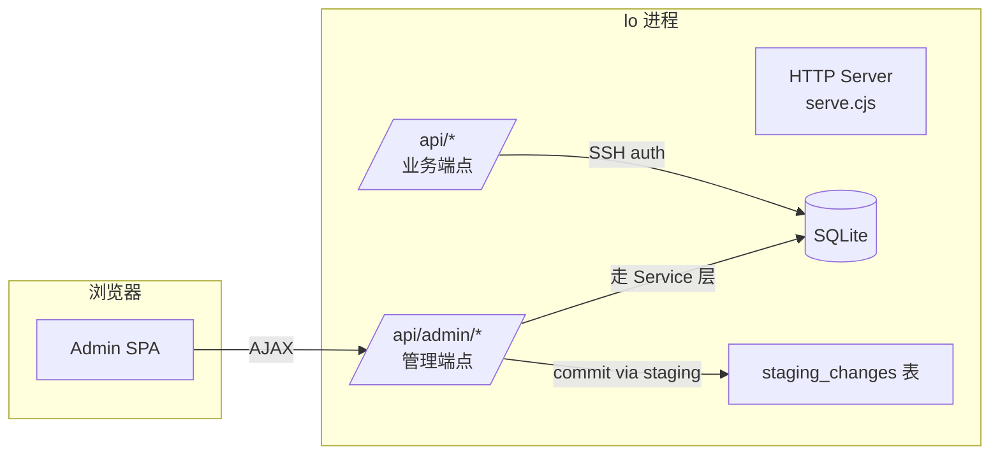

## admin — 管理后台

**用法:** `lo admin [--port <端口>]`

启动 lo 的管理后台（含本地 API 服务和 Web 界面），在浏览器中操作知识库。

### 架构

```
lo admin
  → 启动 HTTP 服务（127.0.0.1:8765）
  → 托管 admin SPA（Vue 3 + Element Plus + TypeScript）
  → 自动打开浏览器 http://localhost:8765/admin/
```



管理后台通过 HTTP API（`/api/admin/*`）与 lo 后端交互。服务仅监听 `127.0.0.1`，只有本机可访问。设置环境变量 `LO_ADMIN_TOKEN`（或 `lo admin --admin-token <密钥>`）后，`/api/admin/*` 要求请求头携带 `Authorization: Bearer <密钥>`；未设置时不启用认证。

### 选项

- `--port, -p <端口>` — 监听端口（默认: 8765）
- `--repo, -r <路径>` — 仓库目录
- `--admin-token <密钥>` — Admin API 共享密钥（也可通过环境变量 `LO_ADMIN_TOKEN` 设置）

### 管理后台功能

| 模块 | 功能 |
|------|------|
| 仪表盘 | 资源总数、关系数、标签数、待处理建议 |
| 资源管理 | 列表/搜索/创建笔记/导入文件/编辑/删除 |
| 资源详情 | 编辑标题/内容、标签管理（增删）、关系管理（关联/断开）、改类型 |
| 关系图谱 | 力导向图可视化（vis-network） |
| 容器管理 | 容器列表/成员浏览/扫描/升级/降级 |
| 建议中心 | AI 建议查看/接受/拒绝/执行 |
| 元数据管理 | 类型/标签/分类的统一管理面板（重命名、删除） |
| 设置 | 当前 API 地址（自动为页面所在地址） |

#### 关于创建和导入

- **创建笔记**：仅允许创建 `note` 类型的 `.md` 文件，类型不可更改
- **导入文件**：支持批量导入（一行一个绝对路径），类型自动根据扩展名推断（如 `.jpg`→`image`）
- 其他类型资源只能通过导入产生

#### 关于元数据

类型和分类仍为非独立实体（`resources` 表中的字段），标签已独立为 `resource_tags` 表。重命名/删除本质是批量 UPDATE。

### 示例

```
lo admin               # 默认端口 8765
lo admin --port 3000   # 自定义端口
```

### 技术栈

- 前端: Vue 3 + TypeScript + Element Plus + Vue Router
- 图谱: vis-network
- HTTP: axios
- 构建: Vite

### 注意事项

- 服务仅绑定 `127.0.0.1`，外部无法直接访问
- 管理后台和 `lo serve` 共享同一个 HTTP 服务进程
- 后端 API 端点与 SSH 认证隔离，`/api/admin/*` 为独立路由组

### 相关命令

- [serve](serve.md) — HTTP API 服务
- [docs serve](docs-serve.md) — 文档站点
